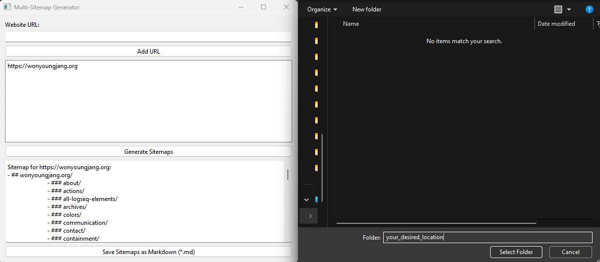

# Sitemap Scraper

Get the sitemap structure of one to many sites. Save to structured markdown if desired.

## Table of Contents
- [Languages Used](#languages-used)
- [Technologies Used](#technologies_used)
- [Installation](#installation)
- [Usage](#usage)
- [License](#license) 

## Languages Used
Python

## Prerequisites
PySide6

## Installation 

1. Clone this repository
2. Install dependencies: `pip install PySide6`

## Usage
1. Run the application: `python gui.py`
2. Enter a website you'd like to get the sitemap for
3. Add it to the list
4. (Optional) Add additional sites
5. Generate sitemaps
6. (Optional) Save results to markdown

Note: Markdown generates a separate markdown file for each site given.

## License
[MIT License](LICENSE)